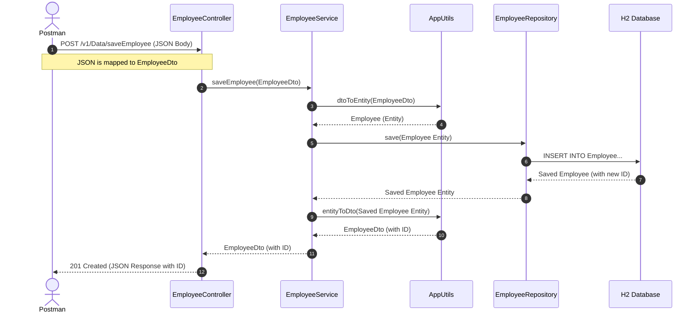

# Employee Save Flow: From Request to Database

Here is the complete journey of what happens when you send data from Postman to your Spring Boot application.

### Step-by-Step Explanation

1. **The Request (Postman ➔ Controller)**: 
   You hit **Send** in Postman. Postman sends a JSON body (e.g., `{"name": "Mohit"}`) to your endpoint `http://localhost:8080/v1/Data/saveEmployee`. Spring Boot intercepts this, sees the `@RequestBody` annotation, and magically converts the JSON string into an `EmployeeDto` object. It then hands this DTO to `EmployeeController`.

2. **Delegating to Business Logic (Controller ➔ Service)**: 
   The Controller's only job is to be the bouncer at the door. It doesn't do heavy lifting. It takes the `EmployeeDto` and immediately passes it down to the `EmployeeService` by calling `service.saveEmployee(dto)`.

3. **Converting Data (Service ➔ AppUtils)**: 
   The Service receives the DTO. However, the database layer only understands `Employee` entities. So, the Service calls `AppUtils.dtoToEntity()` to copy the data from the DTO into a brand new `Employee` entity object.

4. **Saving to Database (Service ➔ Repository ➔ DB)**: 
   Now that the Service has a proper `Employee` entity, it hands it to the `EmployeeRepository` by calling `repository.save()`. The Repository acts as a translator to the Database. It generates the SQL `INSERT` statement and executes it against your H2 Database. 

5. **Getting the New ID (DB ➔ Repository ➔ Service)**: 
   The database saves the record and assigns it a brand new auto-generated ID (e.g., `id: 1`). The Repository receives this saved record back from the database and returns it to the Service as a `savedEntity`.

6. **Converting Data Back (Service ➔ AppUtils)**: 
   The Service now has the saved entity (with the new ID), but it needs to send a DTO back to the Controller. It calls `AppUtils.entityToDto()` to copy the data from the `savedEntity` into a new `EmployeeDto`.

7. **The Response (Service ➔ Controller ➔ Postman)**: 
   The Service hands the finalized `EmployeeDto` back to the Controller. The Controller wraps it in a `ResponseEntity` with a `201 CREATED` status code. Spring Boot automatically converts this DTO back into a JSON string and sends it all the way back over the internet to Postman, where it appears on your screen!
