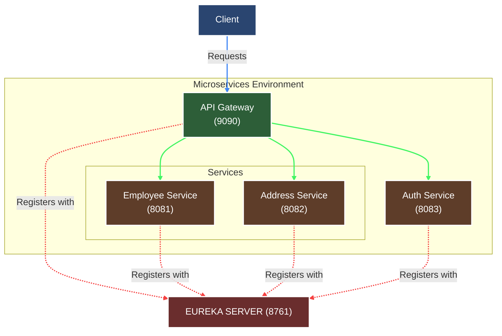

# System Architecture

Below is the microservices architecture diagram recreated from the provided image.

```mermaid
graph TD
    %% Define Styles
    classDef client fill:#2a4570,stroke:#fff,stroke-width:2px,color:#fff
    classDef gateway fill:#2d5e38,stroke:#fff,stroke-width:2px,color:#fff
    classDef service fill:#5e3d29,stroke:#fff,stroke-width:2px,color:#fff
    classDef eureka fill:#6a2d2d,stroke:#fff,stroke-width:2px,color:#fff

    %% Nodes
    Client["Client"]:::client
    
    subgraph Microservices Environment
        Gateway["API Gateway<br>(9090)"]:::gateway
        
        subgraph Services
            Employee["Employee Service<br>(8081)"]:::service
            Address["Address Service<br>(8082)"]:::service
        end
        
        Auth["Auth Service<br>(8083)"]:::service
    end
    
    Eureka["EUREKA SERVER (8761)"]:::eureka

    %% Connections
    Client -->|Requests| Gateway
    
    Gateway --> Employee
    Gateway --> Address
    Gateway --> Auth
    
    Gateway -.->|Registers with| Eureka
    Employee -.->|Registers with| Eureka
    Address -.->|Registers with| Eureka
    Auth -.->|Registers with| Eureka

    %% Link Styles to roughly match image colors
    linkStyle 0 stroke:#4287f5,stroke-width:2px;
    linkStyle 1,2,3 stroke:#42f563,stroke-width:2px;
    linkStyle 4,5,6,7 stroke:#f54242,stroke-width:2px;
```
