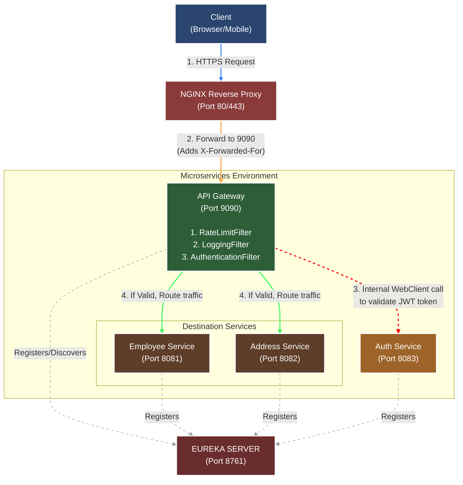

# System Architecture with NGINX

Below is an updated architecture diagram showcasing the traffic flow with an NGINX Reverse Proxy and how the API Gateway internally communicates with the Auth Service.

### Flow Explanations

**Flow 1 (External Request):**
1. The **Client** sends a request to NGINX on port 443.
2. **NGINX** appends the client's true IP into the `X-Forwarded-For` header and forwards the request to the **API Gateway** on port 9090.
3. The API Gateway runs through the filter chain:
   * **RateLimitFilter**: Checks the IP in `X-Forwarded-For`.
   * **LoggingFilter**: Logs the IP and path.
   * **AuthenticationFilter**: Sees a protected route and needs to validate the token (Triggers Flow 2).
4. After validation succeeds, the Gateway routes the request to the `Employee` or `Address` service.

**Flow 2 (Server-to-Server Internal Validation):**
1. The `AuthenticationFilter` in the Gateway suspends the request.
2. It uses `WebClient` to make an internal HTTP call to `http://AUTHSERVICE/auth/validate`.
3. The internal LoadBalancer asks **Eureka** where `AUTHSERVICE` is located.
4. The request goes directly to the **Auth Service** (bypassing NGINX).
5. The Auth Service returns success, and the Gateway un-suspends the original client request.
